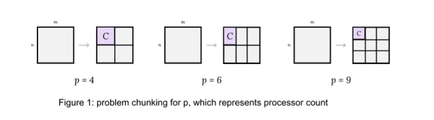
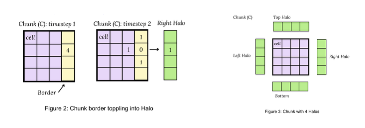
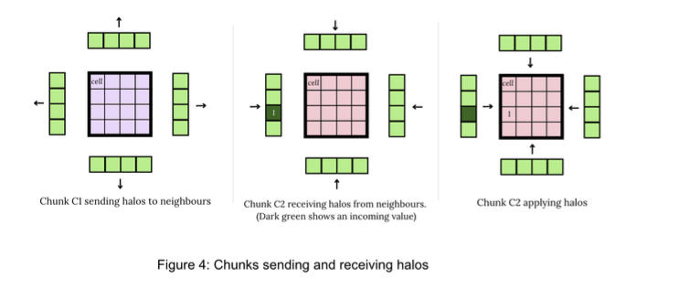

# Parallel Abelian Sandpile Simulation

This repository contains implementations of the **Abelian Sandpile Model** using both **serial** and **MPI-based parallel** approaches. These were developed as part of a high-performance computing project to study scalability and simulation efficiency.

> Note: execution time is noticeable depending on simulation size. 
---

## MPI Implementation: Parallel Abelian Sandpile Simulation

The MPI version of the simulation uses an **asynchronous, halo-exchanging approach** for parallelisation. It relies on **spatial decomposition**, splitting the simulation grid across MPI processes to distribute computation.

### Parallelisation Strategy

The problem space (`n × m`) is decomposed into **chunks** by dividing the grid according to the number of available processors (`p`). This is managed using an **MPI Cartesian topology**, which assigns chunks to processors in a structured grid layout.

Chunks are assigned to individual processors where **local computation** begins. Cells within each chunk topple iteratively. When a topple causes sand to spill beyond the chunk’s boundary, the excess is stored in **halo buffers**.

Each chunk maintains four halo regions (top, bottom, left, right) to track overflow into neighboring chunks.

### Halo Exchange and Synchronisation

After each local computation round, halo buffers are **sent asynchronously** to neighboring chunks. When halos are received, the values are **applied to the corresponding border cells** in the chunk.

This enables continued computation using up-to-date information from neighbors.

### Asynchronous Execution and Convergence

This process is **asynchronous**: each chunk performs local computation, sends halos, receives updates, and continues computing—regardless of its neighbors' state.

**Global convergence** occurs when:
- All sent halo messages have been received (no in-flight messages), and
- All chunks are locally stable (no more topplings required).

At this point, each chunk is gathered and **stitched together** to form the final simulation output.

##  Contents

- `SERIAL/` – Serial CPU implementation  
- `MPI/` – Parallel implementation using MPI  

---

##  Usage
SERIAL:
    Build the program by running:
        make

    Run a default test by running:
        make run

    Clean build artifacts by running:
        make clean

MPI:
    Build the program by running:
        make all

    Run a default test by running:
        make run
        This sets number of processes = 8 and runs: mpirun -np 8 ./MPI_abelian_sandpile 1024 1024 526338

    Custom runs:
        To change the run target, edit the 'run' line in the Makefile.
    
    Or run manually:
        Manually run:
             mpirun -np <num processes> ./MPI_abelian_sandpile <rows> <columns> <INIT_VALUE>

    Clean build artifacts by running:
        make clean

##  Dependencies

`open-mpi` — MPI-enabled C compiler

